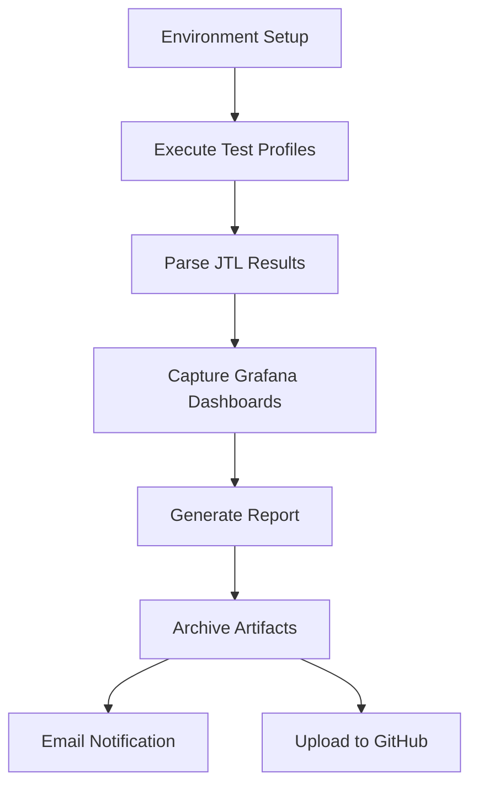

# Performance Testing Project

## Overview

This project executes scheduled weekly performance tests (every Monday – 9 AM PST) against the DummyJSON API and delivers:

- Automated test execution via GitHub Actions  
- Real-time and historical performance metrics in InfluxDB  
- Grafana dashboards for visualization and trend analysis  
- Automated email reports with zipped run artifacts for deep-dive debugging  

The objective is to model a production-like performance testing ecosystem — where test execution, observability, reporting, and artifact retention are fully integrated and require no manual intervention.

---

## Test Profiles

| Profile | Description |
|--------|-------------|
Smoke | Fast validation of core endpoints and assertions |
Load | Baseline performance under expected traffic |
Stress | Identifies system limits under sustained load |
Spike | Validates system behavior during sudden traffic bursts |

---

## Metrics

### Grafana (filtered by test type)

- Throughput (requests/sec)  
- Total success rate (%)  
- Average response time per endpoint (ms)  

### Automated Email Report

- Response time percentiles (p50, p90, p95, p99)  
- Error count  

---

## CI/CD Automation

The GitHub Actions workflow orchestrates the full performance testing lifecycle:



## Artifacts
Each automated run produces a zipped bundle containing:
* JTL results
* JMeter logs
* Grafana dashboard screenshots
* Test Results Summary


## Configuration

The same property-driven configuration is used for both local and CI runs, ensuring consistent and reproducible performance results across environments.

### GitHub Secrets

The CI/CD workflow uses repository secrets to keep credentials secure and environment-agnostic.

Required secrets:

| Secret Name        | Description                                              |
|--------------------|----------------------------------------------------------|
INFLUX_URL           | InfluxDB base URL                                        |
INFLUX_ORG           | InfluxDB organization name                               |
INFLUX_BUCKET        | InfluxDB bucket for JMeter metrics                       |
INFLUX_TOKEN         | InfluxDB API token with write access                     |
GRAFANA_URL          | Base URL of Grafana instance                             |
GRAFANA_RENDER_URL   | Base URL used for capturing screenshots of the dashboard |
GRAFANA_API_KEY      | Grafana API key for dashboard rendering                  |
EMAIL_USERNAME       | SMTP username for sending reports                        |
EMAIL_PASSWORD       | SMTP app password / token                                |
EMAIL_TO             | Recipient email address                                  |

All secrets are injected at runtime by GitHub Actions and are **never stored in the repository**.

---

## Local Execution

### Prerequisites

- Apache JMeter 5.6+
- Java 17+
- Access to the same InfluxDB instance used in CI

### Run a Specific Test Profile (ex. 'Smoke', 'Load', 'Stress', 'Spike', 'All')

```bash
jmeter -n -t performance_tests.jmx \
-JtestRunSelection='Smoke' \
-JINFLUX_URL='https://your-influx-url' \
-JINFLUX_TOKEN='your-token' \
-JINFLUX_ORG='your-org' \
-JINFLUX_BUCKET='your-bucket' \
-l results/test_results.jtl \
-j logs/jmeter.log
```
